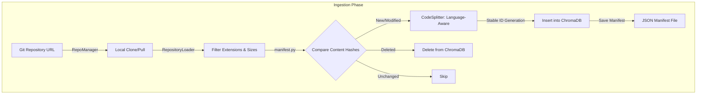
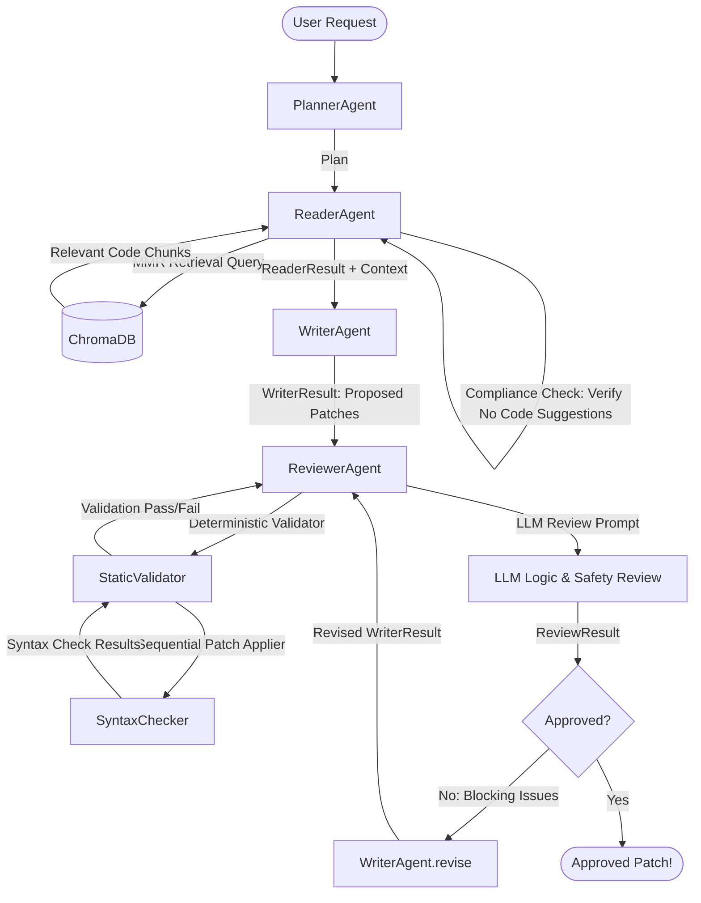

# Code Patch Agent

Demo Link - https://github.com/ankit3890/Code-PatchAgent_Agentic-AI

Code Patch Agent is an agentic pair-programming assistant that automates code analysis, feature planning, code generation, and iterative safety/logic reviews. By combining a multi-agent workflow with a Retrieval-Augmented Generation (RAG) code indexing database, Code Patch Agent can index arbitrary Git repositories, read relevant source files, draft patches, and validate them prior to application.

> [!WARNING]
> **Active Development Warning**: This project is under active development. Some core components—specifically syntax validators for non-Python languages, multi-file validation loops, and complex multi-agent iterations—are experimental. Certain tasks may trigger validation errors or logic review rejections. If the reviewer agent rejects a draft patch throughout all cycles, adjust your request or prompt and run the task again.

---

## 1. System Architecture & Workflows

Code Patch Agent utilizes a four-tier architecture:
1. **Configuration Layer (`config.py`)**: Central settings provider built with Pydantic.
2. **RAG / Code Search Layer (`rag/`)**: Language-aware splitting and Max Marginal Relevance (MMR) retrieval using ChromaDB.
3. **Multi-Agent Coding Pipeline (`agents/`)**: Specialized LLM nodes constrained by Pydantic structured output validation.
4. **Deterministic Validation Layer (`reviewer/`)**: In-memory syntax checks and block validation.

### Repository Indexing Workflow
The ingestion pipeline processes files incrementally using content hashes to minimize indexing costs:



### Multi-Agent Code Generation & Review Loop
The task execution flow leverages a Planner, Reader (with solution suggestions block checks), Writer, and a Reviewer that performs both static syntax checking and semantic checks:



---

## 2. Directory Structure

```text
├── agents/             # Multi-agent role implementations (Planner, Reader, Writer, Reviewer)
├── api/                # FastAPI web server and SSE log broadcaster
├── git_utils/          # Local repository clone, pull, and workspace managers
├── prompts/            # Structured prompts and schemas for Pydantic LLM outputs
├── public/             # Web client UI (index.html, style.css, app.js)
├── rag/                # Code indexing, loaders, splitters, and retrievers
├── reviewer/           # In-memory code patch validation and syntax checks
├── tests/              # Test suites
├── vercel.json         # Vercel Serverless routing deployment config
└── pyproject.toml      # Dependency specifications
```

---

## 3. Getting Started

### Prerequisites
* Python 3.10 or 3.11
* [uv](https://github.com/astral-sh/uv) (recommended Python package manager)

### Installation

1. Clone this repository locally.
2. Initialize the virtual environment and install the required dependencies:
   ```bash
   uv venv
   .venv\Scripts\activate      # Windows PowerShell/Command Prompt
   # or source .venv/bin/activate (macOS/Linux)
   
   uv pip install -r requirements.txt
   ```

### Configuration

Create a `.env` file in the root directory to declare your defaults:
```env
MISTRAL_API_KEY=your_mistral_api_key_here
# Optional:
OPENAI_API_KEY=your_openai_api_key_here
GEMINI_API_KEY=your_gemini_api_key_here
GROQ_API_KEY=your_groq_api_key_here
```

### Running the Web Server

Launch the FastAPI application locally:
```bash
.venv\Scripts\uvicorn.exe api.index:app --port 8000
```
Open [http://localhost:8000](http://localhost:8000) in your web browser.

---

## 4. Key Web Client Features

* **Visual Agent Pipeline Tab**: Tracks agent workflows (Planner, Reader, Writer, Reviewer) step-by-step in real time. Shows evaluations, goals, code context matches, and review cycle decisions.
* **Configuration Manager**: Customize settings dynamically at runtime (LLM model name, provider, chunk limits, MMR ratios, review cycle limits).
* **API Key Local Persistence**: Enter your custom provider API key inside the settings panel. It gets written directly to the project's local `.env` file and reloaded instantly.
* **System logs**: Monitor stream console logging outputs in a separate tab, with automated log scrubbing to protect secrets like API tokens and passwords.
* **Diff Patches**: Displays search-and-replace diff listings in a green/red visual format.
* **Task Alerts**: Displays warning banners with prompt improvement recommendations if a task run terminates without approval from the Reviewer Agent.
